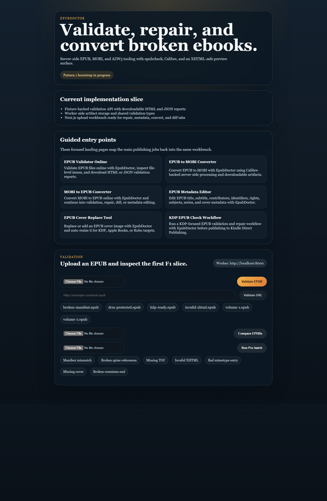

# EpubDoctor

EpubDoctor validates, repairs, converts, diffs, and edits metadata for EPUB, MOBI, and AZW3 ebooks with a server-side worker powered by FastAPI, Calibre, and EPUB tooling. It is built for the self-publishing workflow: upload a broken book, inspect the report, apply repairs, preview the package, edit metadata, convert formats, compare volumes, and export repaired artifacts.



## Current scope

- Validate EPUB files and export HTML and JSON reports.
- Repair seven common EPUB issues: manifest mismatch, broken spine refs, missing TOC, invalid XHTML, bad mimetype entry, missing cover, and malformed `container.xml`.
- Browse and preview unpacked XHTML, CSS, XML, images, and other package files.
- Edit metadata including contributors, identifiers, subjects, rights, series, and cover presets.
- Convert EPUB, MOBI, AZW3, PDF, and HTML with Calibre-compatible options.
- Compare two EPUBs for structure, metadata, and chapter text changes.
- Run Pro-style ZIP batch validation and repair with CSV and repaired ZIP downloads.
- Refuse DRM-protected EPUBs with a friendly message.

## Repository layout

```text
apps/
  web/       Next.js 15 app
  worker/    FastAPI worker with native dependencies
packages/
  shared-types/
  shared-ui/
  shared-worker-runtime/
tests/fixtures/
```

## Local development

### Prerequisites

- Node 22+
- pnpm 10+
- Python 3.12 for the worker
- Docker 24+ for the containerized path

### Workspace checks

```bash
pnpm install
pnpm lint
pnpm typecheck
pnpm test
pnpm build
```

### Worker tests

The worker targets Python 3.12. On machines where the host Python differs, use the Docker-backed verification path:

```bash
docker run --rm -v "${PWD}:/workspace" -w /workspace/apps/worker python:3.12-slim \
  bash -lc "pip install -r requirements.txt && python ../../tests/fixtures/generate_epub_fixtures.py && pytest -q"
```

### Full stack with Docker Compose

```bash
docker compose up --build
```

Services:

- Web: [http://localhost:3000](http://localhost:3000)
- Worker health: [http://localhost:8000/health](http://localhost:8000/health)

The worker container installs JRE 17, Calibre, and `epubcheck`, then pre-warms runtime dependencies on startup. The health endpoint reports whether Java, Calibre, and `epubcheck` were detected.

Uploaded inputs and generated artifacts are stored under the worker temp directory and expire automatically. Override the retention window with `EPUBDOCTOR_RETENTION_TTL_SECONDS` if you need a shorter or longer cleanup period when self-hosting.

### Render blueprint

The repo includes [`render.yaml`](render.yaml) for a public Next.js web service plus a private worker service. Set the repo root as the Render blueprint source, let Render create both services, and point your public custom domain at the web service once the deploy is healthy.

### Hosted verification and deploy hooks

Once the hosted app exists, set these GitHub Actions values so the repo can verify and, if needed, manually trigger the deployment:

- Repository variable: `EPUBDOCTOR_PUBLIC_URL`
- Repository variable: `RENDER_WORKSPACE_ID`
- Repository secret: `RENDER_API_KEY`
- Repository secret: `RENDER_WORKER_DEPLOY_HOOK_URL`
- Repository secret: `RENDER_WEB_DEPLOY_HOOK_URL`

The hosted smoke script can then verify the public site end to end:

```bash
python scripts/verify_hosted_deployment.py --base-url https://your-public-domain.example
```

It checks the homepage, source link, SEO routes, proxied worker health, and real hosted validation requests for `broken-manifest.epub` and `kdp-ready.epub`.

If you want GitHub to validate the Render blueprint itself before deployment, the `render-blueprint-validate` workflow also needs `RENDER_API_KEY` and `RENDER_WORKSPACE_ID`.

## Sample fixtures

Fixtures used by tests and manual QA live in `tests/fixtures/`:

- `broken-manifest.epub`
- `kdp-ready.epub`
- `invalid-xhtml.epub`
- `drm-protected.epub`
- `legacy-epub2.epub`
- `volume-1.epub`
- `volume-2.epub`
- `mobi-sample.mobi`
- `azw3-sample.azw3`

## Qualification tracking

Release qualification work is tracked against `RELEASE_QUALIFICATION_CHECKLIST.md` Section 5. The current working report lives in `docs/qc-appendix-b.md`.

## License and combined-work note

This repository is licensed under AGPL-3.0. The worker container also bundles Calibre, which is GPL-licensed software, and `epubcheck`, which is distributed separately from this repository. When you distribute a built image or hosted service derived from this repo, you are responsible for providing the complete corresponding source for the combined work and preserving the notices and license obligations of AGPL-3.0, GPL, and the bundled third-party components.
